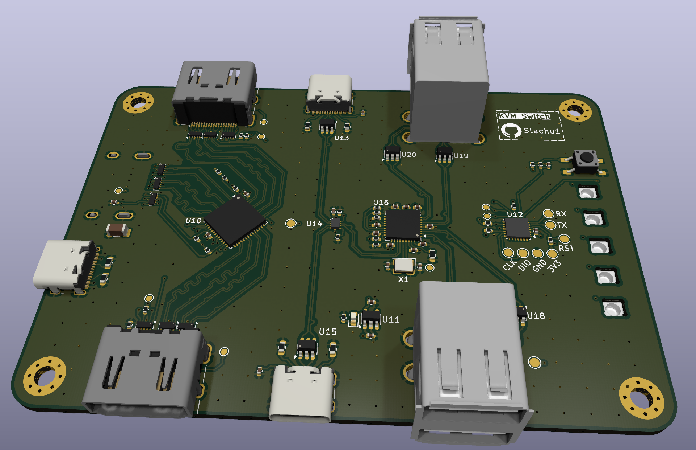
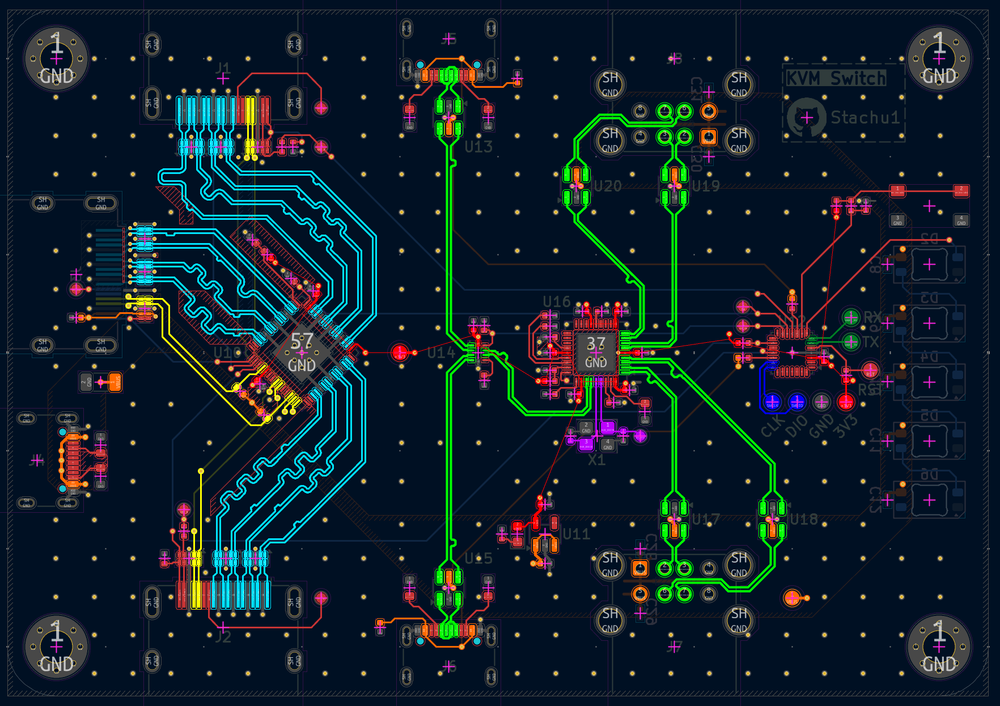

# KVM Switch

A two-computer HDMI + USB KVM switch designed in KiCad.

This is a personal project with the goal of learning more about digital high-speed PCB design: controlled-impedance differential pairs, length matching, layer stackup and keeping signal integrity in check on HDMI and USB lines.

## PCB






## Assembled device


## Overview

- Switches one HDMI display between two HDMI sources (TI HD3SS215)
- Shares USB peripherals between two hosts through a USB 2.0 hub (Microchip USB2514B) and a USB host selector (TI TS3USB221A)
- Two USB-C upstream ports for the hosts, stacked USB-A ports for peripherals
- STM32C031 microcontroller handles input selection via a push button, with an RGB status LED
- ESD protection on all external HDMI and USB connectors
- Powered over USB-C
- 4-layer PCB

## Repository layout

```
hardware/   KiCad project (schematics, PCB, custom library, BOM)
firmware/   Firmware for the STM32 (work in progress)
images/     Pictures used in this README
```

## Tools

- KiCad 10
